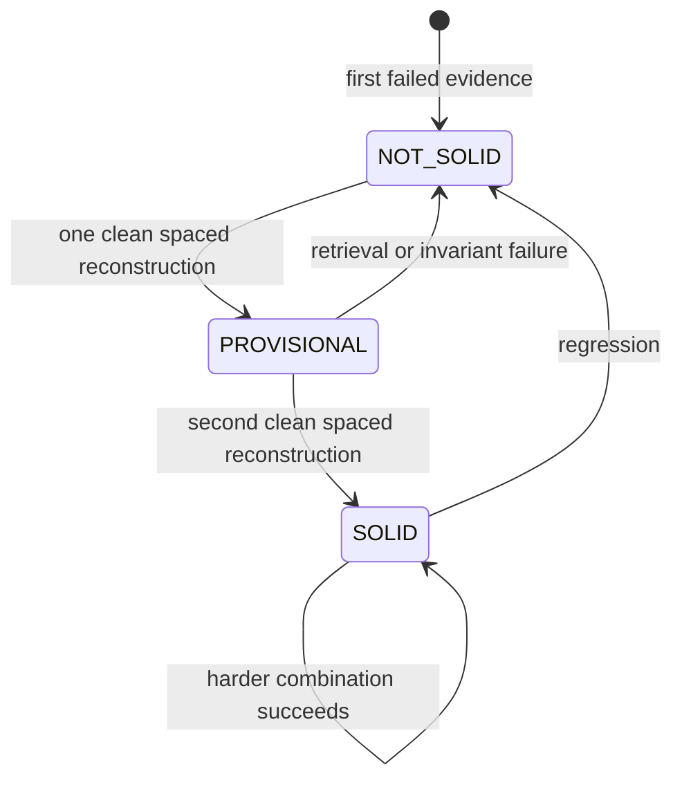
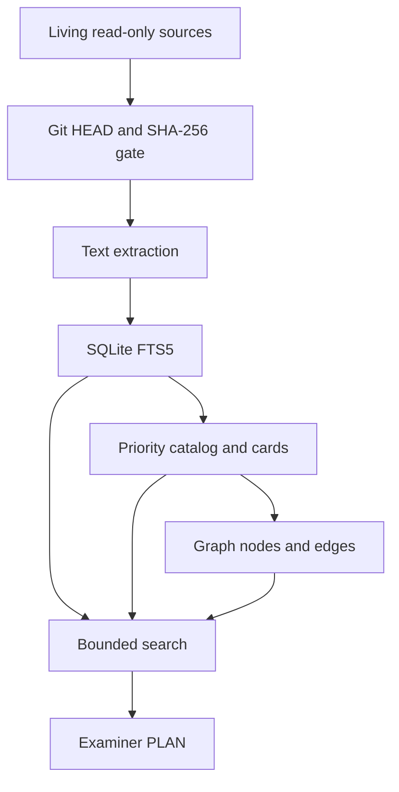

# Operating Diagrams

## Mock lifecycle

## Mastery lifecycle

`PROVISIONAL` is a lifecycle state only; reported mastery remains binary `NOT-SOLID` until the second clean reconstruction.

## Bounded retrieval

